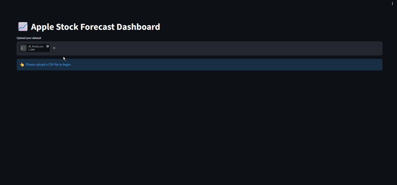
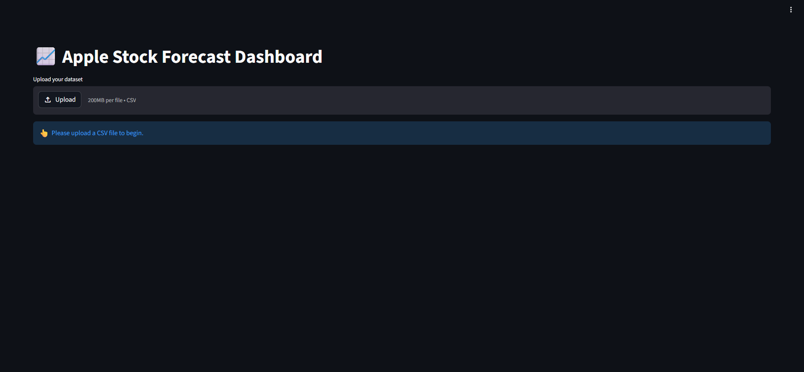
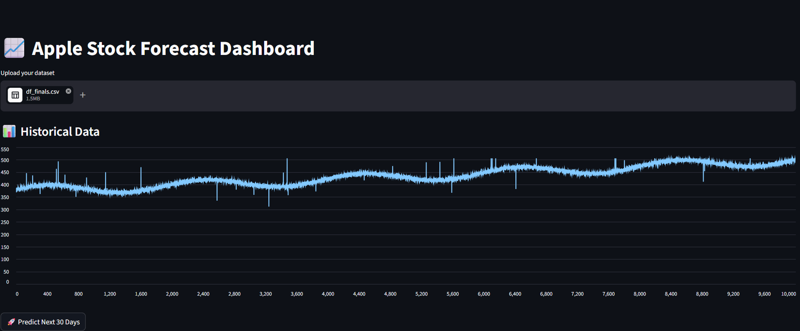
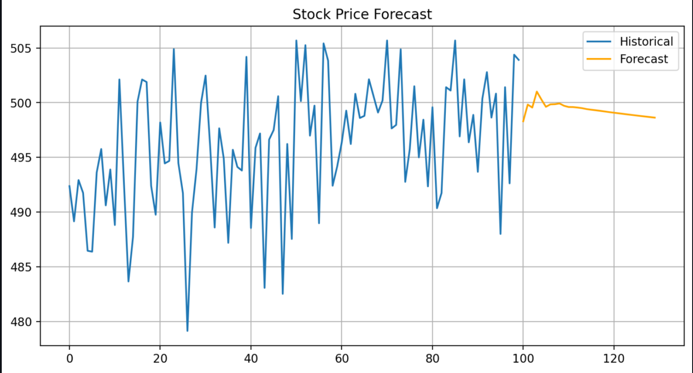
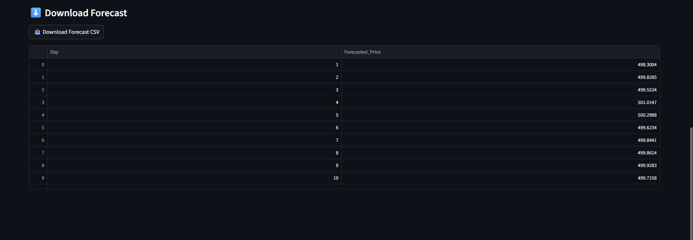

# 📈 Apple Stock Forecasting System (VAR | FastAPI | Streamlit | Docker | GCP Deployment)

🚀 Production-ready ML system with real-time forecasting and <1% error deployed on cloud.


---

🚀 **Live App:** http://34.131.252.227:8501

⚡ **API Docs:** http://34.131.252.227:8002/docs

🔥 Achieved **<1% forecasting error (MAPE)** using multivariate time series (VAR) deployed on cloud.

🎯 End-to-end ML system:
**Data → Model → API → Dashboard → Docker → Cloud Deployment**

---

## 🎥 Live Demo (Quick Preview)



---

## 📸 Dashboard Preview

### 📊 Step 1: Upload Dataset & View Historical Trends



### 📉 Step 2: Generate Forecast



### 📈 Step 3: Forecast vs Historical Comparison



### ⚡ Step 4: FastAPI Backend Interface



---

## 🏆 Why This Project Stands Out

✔ Real-time deployed ML system (not just notebook)

✔ Multivariate forecasting (beyond basic models)

✔ Cloud-hosted application with public access

✔ API + UI integration

✔ Production-style architecture

✔ Dockerized deployment workflow

✔ Containerized ML inference pipeline

---

## 🔥 Project Highlights

✔ Multivariate Time Series Forecasting using VAR

✔ Incorporates macroeconomic indicators (S&P 500, sentiment)

✔ Data preprocessing using differencing for stationarity

✔ Real-time prediction via FastAPI

✔ Interactive dashboard using Streamlit

✔ 30-day future forecasting capability

✔ End-to-end ML pipeline (data → model → deployment)

✔ Dockerized API deployment

✔ Cloud deployment on GCP VM with static IP

---

## 🧠 Problem Statement

Stock prices are influenced by multiple external factors and are highly volatile.

👉 Traditional models fail to capture relationships between multiple market indicators.

👉 This project uses a **multivariate VAR model** to capture dependencies between stock price, market index, and sentiment.

💼 **Impact:** Enables realistic short-term forecasting and data-driven investment insights.

📈 Enables better short-term decision making for trading and market trend analysis.

---

## 📊 Dataset

* Source: Synthetic financial dataset
* Size: ~100,000 rows

### Features:

* stock_price
* sp500_index
* market_sentiment

### 🔧 Preprocessing

* Removed missing values
* Applied **first-order differencing** for stationarity
* Selected relevant multivariate features

---

### 📂 Dataset Availability

The cleaned dataset used for modeling is available in:

👉 `data/df_finals.csv`

#### 📌 Features Used

* stock_price → Apple stock price
* sp500_index → Market index
* market_sentiment → Sentiment indicator

#### 🔧 Additional Processing

* Log transformation applied
* Outliers handled
* Stationarity ensured using differencing

📈 This dataset captures both **market behavior and sentiment**, enabling accurate multivariate forecasting.

---

## 🏗️ System Architecture

```text
User
 ↓
Streamlit Dashboard
 ↓
FastAPI API
 ↓
Preprocessing (Differencing)
 ↓
VAR Model
 ↓
Forecast Output
```

---

## 🏗️ Dockerized Architecture

```text
Docker Container
│
├── FastAPI Backend
├── Time Series Forecasting Pipeline
├── Trained VAR Model
├── Forecast Engine
└── REST API Service
```

---

## 🏗️ Architecture Details

* FastAPI handles real-time prediction requests
* Streamlit provides interactive visualization
* VAR captures multivariate temporal dependencies
* Differencing ensures stable time-series modeling
* Predictions reconstructed to original scale
* Docker ensures consistent deployment environment

---

## 📈 Model Performance

The model was evaluated on a hold-out test set using standard regression metrics.

### 📊 Evaluation Metrics

| Metric   | Value     | Interpretation           |
| -------- | --------- | ------------------------ |
| **MAE**  | 4.39      | Average prediction error |
| **RMSE** | 5.54      | Penalizes larger errors  |
| **MSE**  | 30.72     | Error variance           |
| **MAPE** | **0.91%** | Very high accuracy (<1%) |

---

📌 **Key Highlight:** Achieved **<1% MAPE → extremely high forecasting accuracy**

---

### 🧠 Performance Insights

* Achieved **<1% MAPE**, indicating highly accurate short-term forecasts

* Low RMSE (~5.5) shows predictions remain close to actual trends

* Stable results due to:

  * Multivariate modeling
  * Proper preprocessing
  * Feature selection

---

### 📌 Key Takeaway

👉 Model is **production-ready for short-term forecasting**

👉 Provides **stable, realistic predictions without extreme volatility**

---

## 📈 Model Comparison

Multiple models were evaluated to determine the best forecasting approach.

### 📊 Comparison Table

| Model   | RMSE | MAE  | MAPE        |
| ------- | ---- | ---- | ----------- |
| SARIMAX | 6.46 | 4.77 | 0.00997     |
| VAR     | 5.54 | 4.39 | 0.00907     |
| LSTM    | 5.44 | 4.27 | **0.00886** |

---

### 🧠 Insights

#### 🔴 SARIMAX

* Limited ability to capture multivariate dependencies
* Higher prediction error

---

#### 🟡 VAR

* Captures relationships between stock price, market index, and sentiment
* Stable and interpretable
* Ideal for financial time series

---

#### 🟢 LSTM

* Best accuracy
* Captures nonlinear patterns

⚠️ However:

* Higher complexity
* Slower inference
* Harder to deploy

---

## 🏆 Final Model Selection: VAR

Although LSTM achieved slightly better accuracy, **VAR was selected** due to:

✔ Strong multivariate relationships in data

✔ Better interpretability

✔ Faster inference (important for APIs)

✔ Lower deployment complexity

✔ More stable forecasting behavior

📌 The project prioritizes **production efficiency and scalability over marginal accuracy gains**

---

## 🌐 Live Cloud Deployment

🚀 Deployed on Google Cloud Platform (GCP)

### 📊 Streamlit Dashboard

👉 http://34.131.252.227:8501

### ⚡ FastAPI API Docs

👉 http://34.131.252.227:8002/docs

⚠️ Note: Demo may be unavailable if VM is stopped to optimize cost.

---

## 🐳 Dockerized Deployment

This project has been fully containerized using Docker for reproducible and production-ready deployment.

---

## 🚀 Why Docker?

✔ Ensures consistent environment across systems

✔ Eliminates dependency conflicts

✔ Simplifies deployment workflow

✔ Supports scalable cloud-native deployment

✔ Enables isolated execution environment

✔ Improves portability across machines and servers

---

## 📦 Dockerfile Highlights

✔ Lightweight Python 3.11 slim image

✔ Optimized build context using `.dockerignore`

✔ Separate model and app copy strategy

✔ Reduced unnecessary file transfer

✔ Production-ready FastAPI startup command

✔ Optimized containerized deployment workflow

---

## 📂 Docker Files Added

```text
Dockerfile
.dockerignore
```

---

## ⚙️ Build Docker Image

```bash
docker build -t stock-api .
```

---

## ▶️ Run Docker Container

```bash
docker run -p 8002:8002 stock-api
```

---

## 🌐 Access Dockerized API

### FastAPI Swagger Docs

```text
http://localhost:8002/docs
```

---

## 🧠 Docker Optimization Techniques Used

✔ `.dockerignore` to exclude unnecessary files

✔ Avoided large notebook/data transfer

✔ Selective COPY commands instead of `COPY . .`

✔ Lightweight base image (`python:3.11-slim`)

✔ Cached dependency installation layers

✔ Reduced Docker build context size

---

## 📊 Docker Benefits for ML Systems

* Faster deployment
* Reproducible environments
* Easier scaling
* Simplified CI/CD integration
* Better portability across cloud platforms
* Production-grade deployment workflow

---

## 🔥 Production Engineering Concepts Demonstrated

✔ Containerization

✔ REST API Deployment

✔ Dependency Isolation

✔ Build Context Optimization

✔ FastAPI Production Serving

✔ Cloud-Ready Architecture

✔ Dockerized ML Deployment

---

## 🔌 API Example

```bash
curl -X POST "http://34.131.252.227:8002/predict" \
-H "Content-Type: application/json" \
-d '{"input": [[500,4500,0.1],[501,4505,0.2],[502,4510,0.1],[503,4515,0.2],[504,4520,0.3]]}'
```

---

## 🧠 Model Selection Rationale

* VAR captures relationships between multiple time-dependent variables
* Suitable for financial and economic datasets
* Lightweight compared to deep learning models
* Ideal for real-time deployment

---

## ⚖️ Design Trade-offs

* VAR is fast and interpretable but assumes linear relationships
* Deep learning models may improve accuracy but increase complexity
* Chosen approach balances **speed, performance, and deployability**

---

## ⚠️ Limitations

* Assumes linear relationships
* Sensitive to non-stationary data
* Performance depends on input feature quality
* Free-tier cloud deployment may introduce latency

---

## ☁️ Deployment Details

* Platform: Google Cloud Platform (GCP VM)
* OS: Linux (Debian)
* Backend: FastAPI (Uvicorn)
* Frontend: Streamlit
* Networking: Static External IP
* Containerization: Docker

---

## ▶️ Run on Cloud VM

```bash
source env/bin/activate

uvicorn apps_stock:app --host 0.0.0.0 --port 8002

streamlit run apps_stock_ui.py --server.port 8501 --server.address 0.0.0.0
```

---

## 🐳 Run Using Docker

```bash
git clone https://github.com/Kiran-id10/apple-stock-forecasting.git

cd apple-stock-forecasting

docker build -t stock-api .

docker run -p 8002:8002 stock-api
```

---

## 🧰 Tech Stack

* Python
* Pandas
* NumPy
* Statsmodels (VAR)
* FastAPI
* Streamlit
* Docker
* Matplotlib

---

## 📂 Project Structure

```text
apple-stock-forecasting/
│
├── app_stock/
│   ├── app.py
│   └── ui.py
│
├── model/
│   ├── var_model.pkl
│   └── last_values.pkl
│
├── data/
│   ├── df_finals.csv
│   └── sample_data.csv
│
├── screenshots/
│
├── Dockerfile
├── .dockerignore
├── requirements.txt
├── README.md
└── .gitignore
```

---

## ⚙️ Local Setup

```bash
git clone https://github.com/Kiran-id10/apple-stock-forecasting.git

cd apple-stock-forecasting

python3 -m venv env

source env/bin/activate

pip install -r requirements.txt
```

---

## ▶️ Run Locally

```bash
uvicorn app_stock.app:app --reload --port 8002

streamlit run app_stock/ui.py
```

---

## 💡 Key Learnings

* Built an end-to-end time series forecasting system
* Learned importance of preprocessing consistency
* Integrated API + UI for real-time inference
* Deployed ML system on cloud infrastructure
* Solved real-world deployment issues
* Learned Docker containerization
* Optimized Docker build context
* Implemented production deployment workflow

---

## 🎯 Use Cases

* Financial forecasting
* Market trend analysis
* Investment insights
* Economic modeling

---

## 🔮 Future Improvements

* Integrate LSTM / deep learning models
* Add real-time stock data (Yahoo Finance API)
* Include confidence intervals
* Add Docker Compose for multi-container deployment
* Kubernetes deployment
* CI/CD integration

---

## 👨‍💻 Author

**Kiran Kumar S R**

🎓 Data Science & AI Engineer

💼 Actively seeking Data Science / ML opportunities

---

## ⭐ Support

If you found this project useful, give it a ⭐ on GitHub!
